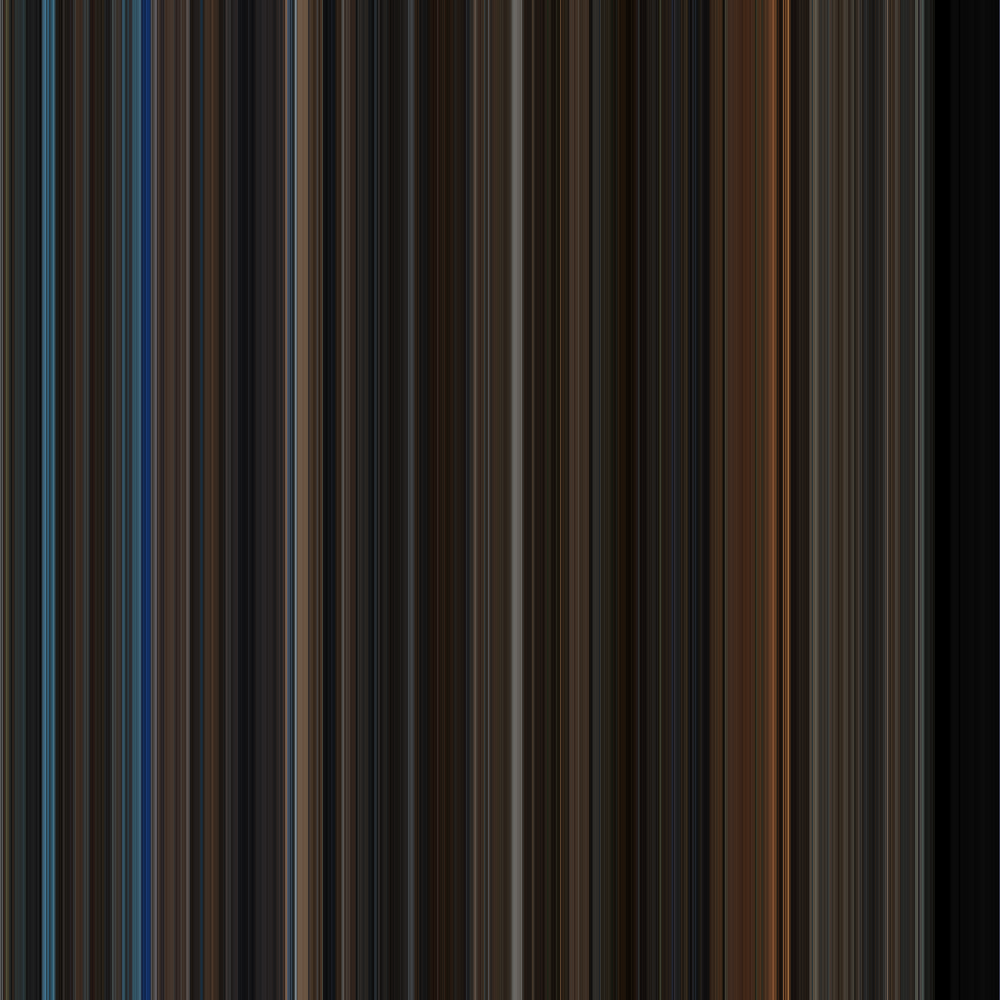
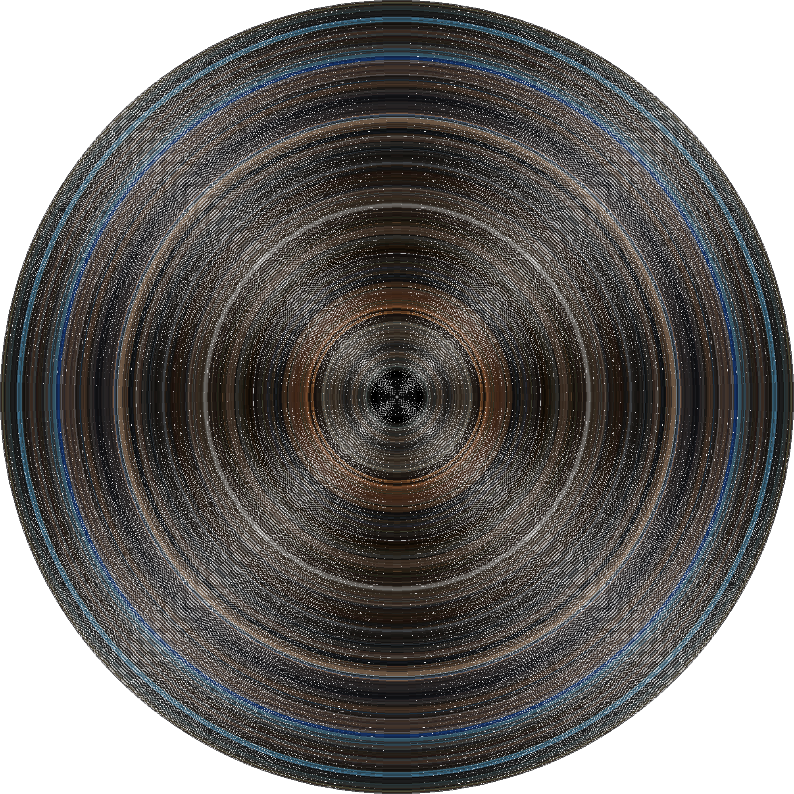

# Color of film

Builds an image representing the chromatic identity of a film from the average color of its frames.

### How to use

Required parameters:

- video file path (obviously)
- resolution: defines the precision of the image to build.
- shapes: defines the shape(s) of the image to build (see example below)

##### Java:

```java
public class Main {
    public static void main(String filePath, int resolution) throws IOException {
        FilmCapture capture = new FilmCapture(filePath);
        ImageBuilder builder = capture.getBuilder(resolution);
        builder.setShapers(new DiscShaper(), new BarCodeShaper());
        builder.build();
    }
}
```

#### CLI

``` console
cd <filedir>
java -jar color-of-film-cli-1.0.0-jar-with-dependencies.jar -fp <filename> -r 1000 --shapes DISC,BARCODE
```

### Example

Batman Begins (2005) - 1080p YIFY

| Barcode | Disc |
| --- | --- |
|  |  |

### How it works

The video file is read using opencv, the video is read frame by frame, for each frame, the mean color value of the frame
is calculated using the library.

The conventional framerate of a movie is 24fps (little less actually), so a 1hour movie is composed of about 86400
frames. Building an image of 86400 pixels aside would be way too costly (around 30 GB of RAM).

Therefore, we split the video in chunks, in which we average the color of all the frames, obtaining a chunk color, which
we paint on the image to build.<br>
The number of chunks is the resolution, so for a resolution of 1000, the provided video is split in 1000 chunks, which
output 1000 colors, which are painted as a line on the output image, in the shape required.

### Warning

The built image is in 32bits, the dimensions are roughly resolution × resolution. During build the image is not
compressed, so the space complexity is quadratic. Therefore, if you use too large resolution you will reach heap space.
For example, using resolution 25000 with the disc shape would result in a 50001 × 50001 image in 32bits which results in
a RAM need of 50001 × 50001 × 4octet = 10 GB
